The project is a hands-on quick revision of the Spring Boot framework. What can you expect by following this repository:

1. How to use [Spring Initializr](https://start.spring.io/) to set up your Spring project. 
2. Understand the structure of the Spring project.
3. Understanding the [pom.xml](./pom.xml).
4. Getting Started with **Spring Boot Web Application**.

Also, some of you might not already know that if you are a student can access the paid tools in the [JetBrains Toolbox](https://www.jetbrains.com/toolbox-app/) for free throughout you being a [student](https://www.jetbrains.com/community/education/#students). Initially, the benefit will be given for 12 months but you can further verify your student status and renew your subscription benefits.

## [Spring Initializr](https://start.spring.io/)
Follow the link and select the options as shown in the below snapshot. For this project, we are using **Maven** to build our project. Further, we are using the latest (to date) stable version of [Spring](https://spring.io/). Under project metadata you name your Group as your name, or your organization's name. Likewise, you can choose the artifact ID and package name as per your choice. Make sure you use the packaging type as JAR and your current Java version should be 17 or 17+ **this is essential for Spring 3.0.0+**.

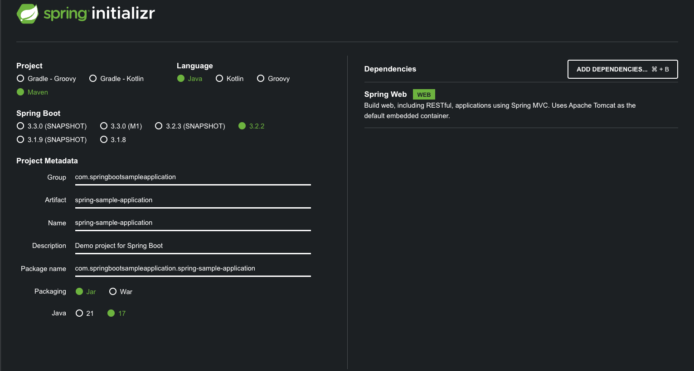

On the right side in the above snapshot you can see [Spring Web](https://docs.spring.io/spring-boot/docs/current/reference/html/) being selected. You can also more dependencies by clicking on **Add Dependencies**. Now click on **Generate** and you will have a .zip folder downloaded with your starter code.

## Structure of the project
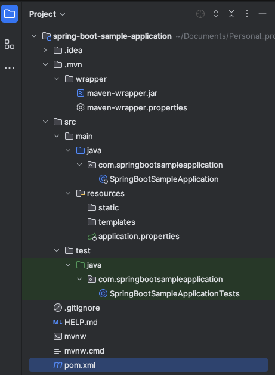

As you can see in the attached snapshot, the unzipped downloaded project looks something like this. You have your **src** and **test** folder with your sample application and application test file generated already. You also have **resources** in which you see **applications.properties** file which is generally used to further configure the [Embedded Web Server](https://docs.spring.io/spring-boot/docs/current/reference/html/howto.html#howto.webserver) in your application, you can use .yml as well as .properties file to do this.

## [pom.xml](./pom.xml)
pom (aka **P**roject **O**bject **M**odel) is an XML file (ofc as you can already see) but this .xml file is a fundamental unit of the Maven project. Let's walk you through this file:

As can be seen in the below section, here we have mentioned the details about the project, which tells us that the project is a spring boot project, and can be identified from the **groupId**. Another significant tag is **version** where you can change the Spring version of your entire application, just by changing the value of this one tag.

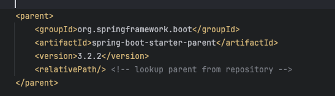

In the below snapshot, you will find the information about your project, what you gave as input to the initializr, and again as you see here you have the **version** tag which helps you to maintain the version of your project/application you can change it to **SNAPSHOT** or **RELEASE** based on your development status and deployment needs.

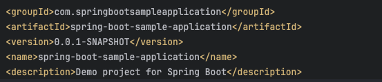

In the following snapshot, you see that the Java version is set to 17, if you remember that's what we set in the spring initializr. So if your IDE is on a version 17+ make sure you update the correct version in the pom here.

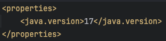

Here in the dependencies, you see all dependencies you added under the **Add Dependencies** section in the initializr. If you notice it also added dependency for **test** along with **web** and if you can relate, in your project structure you also had a separate folder for **test**. Yes, you didn't request for it while initializing but that's what Spring framework provides you with.

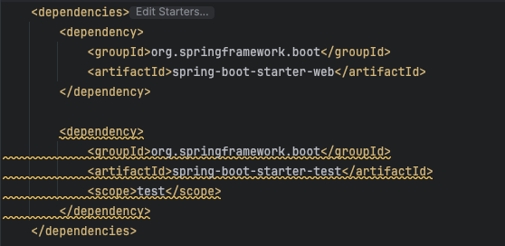

Here you can see the dependency added for your built tool as **Maven**. Although you selected this while initializing, you can also update the built tool to **Gradle** or anything you want by updating this dependency. 

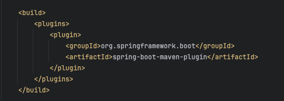

## Spring boot application
The below snapshot shows the quick and simplest Spring Boot API, where you used **@SpringBootApplication** Annotation to create the Application. **SpringApplication.run** to start the application when your program runs the Main function. **@GetMapping** is used to create a GET request (desired path as the parameter) and you need **@RestController** for your GET or PUT request to function. To understand more about how and what all these annotations work follow the [link](https://docs.spring.io/spring-boot/docs/current/reference/html/getting-started.html#getting-started.first-application.code).   

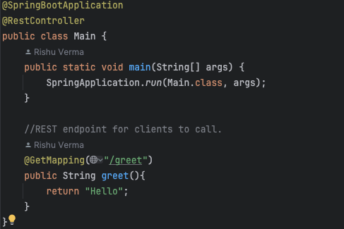

Further, in order to get the JSON response from the class marked with **@RestController**

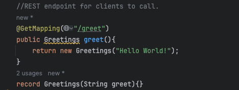

**record** simplifies our work and helps us skip all the boilerplate class code which we need to write with constructors and getters. Otherwise, we would need to make a Greetings class with a private final (immuatable) greet variable, constructor, getter function, @Override toString(), @Override equals and @Override hashCode. So, **record** is one line equivalent to the Greetings class.   

**Jackson** library plays a key role in simplifying behind the scenes hickups and returning us the plan simple JSON blob.
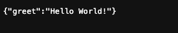

**N-Tier Architecture**
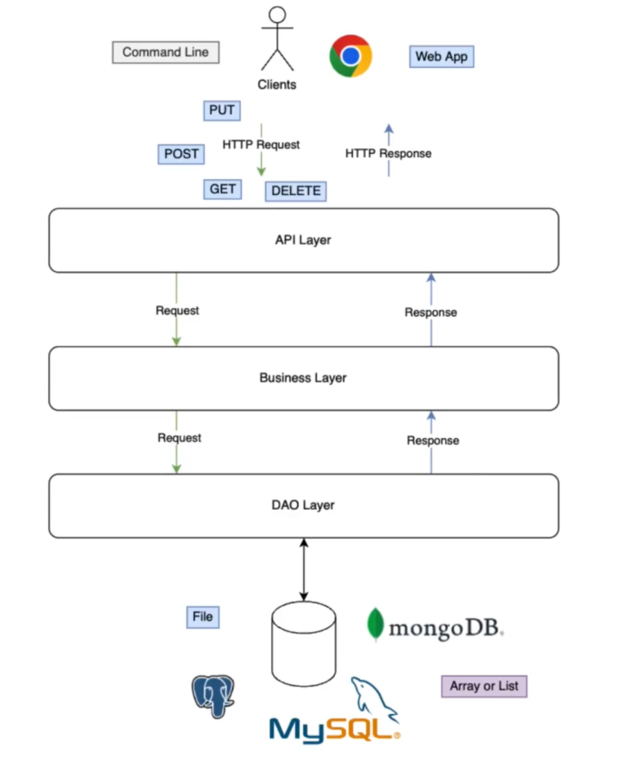
